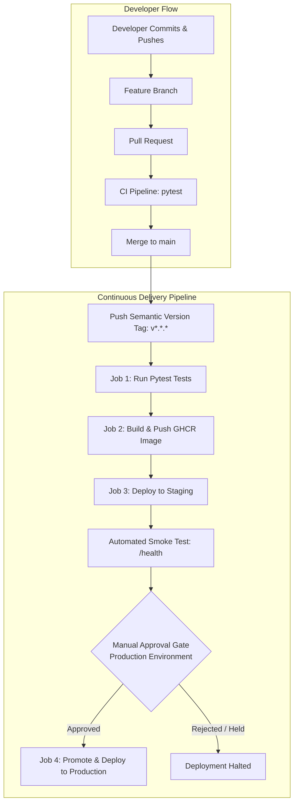

# MLOps Continuous Delivery (CD) for ML Application

[](https://github.com/Shayan6t/mlops-cd-demo/actions/workflows/ci.yml)
[](https://github.com/Shayan6t/mlops-cd-demo/actions/workflows/cd.yml)

> Repository: [https://github.com/Shayan6t/mlops-cd-demo](https://github.com/Shayan6t/mlops-cd-demo)

---

## 1. Overview & Learning Objectives

This project implements a complete, production-grade **Continuous Delivery (CD)** pipeline for a Machine Learning inference service according to the MLOps hands-on tutorial.

### Key Concepts Demonstrated:
1. **CI vs CD vs Continuous Deployment**:
   - **Continuous Integration (CI)**: Validates that code is good enough to integrate (lint, unit tests, security checks).
   - **Continuous Delivery (CD)**: Automatically tests, builds an immutable container artifact, deploys to **staging**, runs automated **smoke tests**, and requires a **manual human approval gate** before releasing to **production**.
   - **Continuous Deployment**: Deploys automatically to production without human approval.
2. **Build Once, Deploy Many (Immutable Artifact Principle)**:
   - The Docker image is built **once** in the CI/CD pipeline and pushed to GitHub Container Registry (GHCR).
   - The **exact same image SHA/tag** tested in staging is promoted to production—source code is never rebuilt per environment.
3. **Semantic Versioning & Container Registry Tagging**:
   - Semantic tags (`v1.0.0`, `v1.1.0`, `v1.3.0`) trigger CD.
   - Dual-tagged in GHCR: `ghcr.io/shayan6t/mlops-cd-demo:<version>` and `latest`.
4. **Environment Approval Gates**:
   - Staging deploys automatically upon release.
   - Production requires explicit reviewer sign-off under GitHub Environments.
5. **Traceability & Rollback**:
   - API exposes application version, model version, and Git commit hash via `/health`.
   - Rollback is executed by deploying a previous immutable image tag without rebuilding.

---

## 2. Delivery Pipeline Architecture



---

## 3. Project Structure

```text
mlops-cd-demo/
├── .github/
│   └── workflows/
│       ├── ci.yml                 # Runs automated pytest gates on Pull Requests
│       └── cd.yml                 # Full CD pipeline triggered on semantic version tags
├── tests/
│   ├── __init__.py
│   └── test_app.py                # Unit tests for /health and /predict
├── scripts/
│   └── rollback.sh                # Automated rollback script to any immutable image tag
├── app.py                         # Flask ML Inference API with traceability metadata
├── Dockerfile                     # Immutable container packaging with build args
├── compose.yaml                   # Multi-environment compose definition (staging / prod)
├── requirements.txt               # Dependencies (Flask, PyTest)
├── pytest.ini                     # Pytest configuration and pythonpath resolution
├── VERSION                        # Semantic application version (1.3.0)
└── README.md                      # Complete architecture, workflow, and verification guide
```

---

## 4. API Specification & Endpoints

### `GET /`
Returns service status.
```json
{
  "service": "mlops-demo",
  "status": "running"
}
```

### `GET /health` (Student Exercise & Traceability Bonus)
Returns application version, model version, git commit hash, and health status:
```json
{
  "application_version": "1.3.0",
  "model_version": "model-7",
  "git_commit": "f58d453",
  "status": "healthy"
}
```

### `POST /predict`
Inference endpoint accepting JSON payload:
```bash
curl -X POST http://localhost:5000/predict \
  -H "Content-Type: application/json" \
  -d '{"value": 5}'
```
Response:
```json
{
  "input": 5.0,
  "prediction": 10.0,
  "model_version": "model-7"
}
```

---

## 5. Release History & Provenance

| Release Tag | Commit Hash | Key Milestone |
| :--- | :--- | :--- |
| **`v1.0.0`** | `8307bf0` | Initial release with base inference API, Docker containerization, and CD pipeline |
| **`v1.1.0`** | `7705040` | Feature branch update (`feature/bump-model-v1.1`) promoting `MODEL_VERSION = "1.1"` |
| **`v1.3.0`** | `f58d453` | Section 30 Exercise & Traceability Bonus (`application_version: 1.3.0`, `model_version: model-7`, short Git commit) |

---

## 6. GitHub Actions Workflows

### 1. Continuous Integration (`ci.yml`)
- **Trigger**: Pull Requests targeting `main`.
- **Steps**:
  1. Check out repository code (`actions/checkout@v4`).
  2. Set up Python 3.12 (`actions/setup-python@v5`).
  3. Install dependencies (`pip install -r requirements.txt`).
  4. Run automated test suite (`pytest`).

### 2. Continuous Delivery (`cd.yml`)
- **Trigger**: Pushes matching semantic version tags (`v*.*.*`).
- **Jobs**:
  1. `test`: Runs test suite before initiating build.
  2. `build`: Extracts version number, authenticates with GHCR via `GITHUB_TOKEN`, builds the image with metadata args (`APP_VERSION`, `GIT_COMMIT`), and pushes both version tag and `latest`.
  3. `deploy-staging`: Targets `staging` environment. Deploys container and runs smoke test (`curl --fail http://...:5000/health`).
  4. `deploy-production`: Requires `deploy-staging` and `build`. Targets `production` environment with **manual reviewer approval gate**.

---

## 7. Rollback Demonstration (Section 25 & 30)

Because images published to GHCR are **immutable and versioned**, rolling back from a problematic release does not require rebuilding code. Simply re-deploy the known-good version.

### Using the Automated Rollback Script:
```bash
# Roll back running mlops-api to version 1.0.0 or 1.2.0:
./scripts/rollback.sh 1.0.0
```

### Manual Rollback Commands:
```bash
# 1. Stop and remove the problematic version container
docker stop mlops-api
docker rm mlops-api

# 2. Re-run the previous known-good immutable image
docker run -d \
  --name mlops-api \
  --restart unless-stopped \
  -p 5000:5000 \
  ghcr.io/shayan6t/mlops-cd-demo:1.0.0

# 3. Verify health
curl http://localhost:5000/health
```

---

## 8. Local Verification

To run tests and container locally:
```bash
# Run pytest tests:
pytest -v

# Build and run Docker container:
docker build -t mlops-cd-demo:local .
docker run --rm -d -p 5000:5000 --name mlops-local mlops-cd-demo:local

# Test health and prediction:
curl http://localhost:5000/health
curl -X POST http://localhost:5000/predict -H "Content-Type: application/json" -d '{"value": 5}'

# Stop container:
docker stop mlops-local
```
